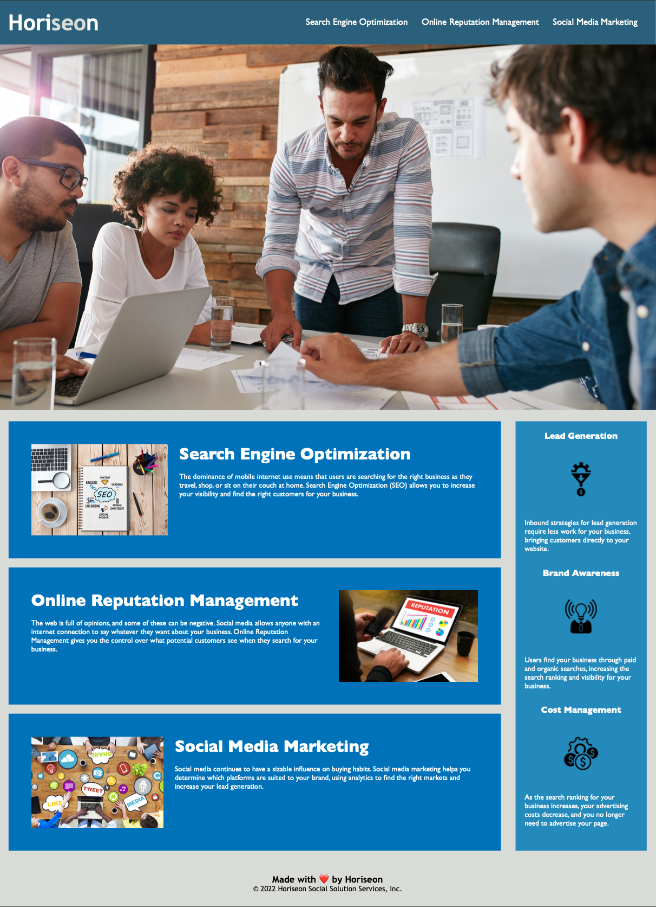

# Horiseon

## Table of contents
1. [The repository](#the-repository)
2. [Horiseon](#horiseon)
3. [Changes](#changes)
4. [Feedback](#feedback)
5. [License](#license)

### The repository

This repository contains the first project for the Edx bootcamp. The goal of this project is to improve the accessibility of the marketing website, Horiseon.

### Horiseon

>Web accessibility is an increasingly important consideration for businesses. It ensures that people with disabilities can access a website using assistive technologies such as video captions, screen readers, and braille keyboards. Making a website accessible is also good for business for many reasons, one of them being that accessible sites are better positioned in search engines like Google. It also helps companies avoid litigation that can occur when people with disabilities cannot access their website.)

### Changes:
- The semantic elements present on the HTML file
- Added comments to quicken readability
- Consolidated and eliminated redundant selectors and elements
- Moved items to logical structure reflected on HTML/CSS
- Added 'alt' elements to icons and images
- Other minor changes

### Feedback

You can [Tweet](https://twitter.com/pandersail) me with a question or provide feedback. :+1:

### License

MIT License

Copyright (c) 2022 Angelo

Permission is hereby granted, free of charge, to any person obtaining a copy
of this software and associated documentation files (the "Software"), to deal
in the Software without restriction, including without limitation the rights
to use, copy, modify, merge, publish, distribute, sublicense, and/or sell
copies of the Software, and to permit persons to whom the Software is
furnished to do so, subject to the following conditions:

The above copyright notice and this permission notice shall be included in all
copies or substantial portions of the Software.

THE SOFTWARE IS PROVIDED "AS IS", WITHOUT WARRANTY OF ANY KIND, EXPRESS OR
IMPLIED, INCLUDING BUT NOT LIMITED TO THE WARRANTIES OF MERCHANTABILITY,
FITNESS FOR A PARTICULAR PURPOSE AND NONINFRINGEMENT. IN NO EVENT SHALL THE
AUTHORS OR COPYRIGHT HOLDERS BE LIABLE FOR ANY CLAIM, DAMAGES OR OTHER
LIABILITY, WHETHER IN AN ACTION OF CONTRACT, TORT OR OTHERWISE, ARISING FROM,
OUT OF OR IN CONNECTION WITH THE SOFTWARE OR THE USE OR OTHER DEALINGS IN THE
SOFTWARE.
